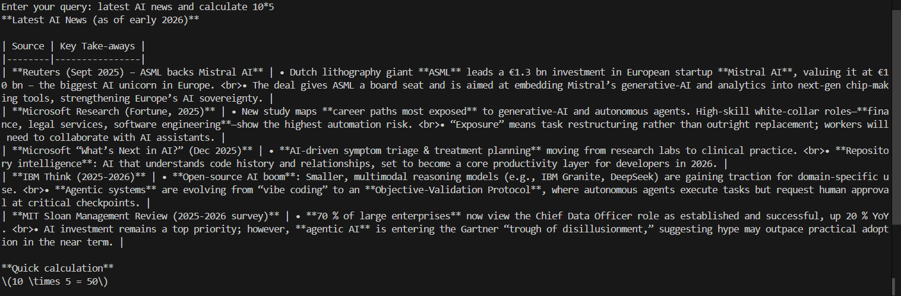

# Simple AI Agent with LangChain + Tavily Web Search

## 📌 Overview

This project demonstrates a **simple AI agent** built using modern LangChain APIs. The agent uses an LLM through OpenRouter and is enhanced with multiple tools, allowing it to:

* Get the current date and time
* Perform mathematical calculations
* Search the web using Tavily
* Parse text (character and word count)

The agent uses LangChain’s `create_agent()` interface, which follows the modern tool-calling architecture.

---

## 🚀 Features

* Modern LangChain agent (`create_agent`)
* Tool-based architecture using `@tool` decorator
* Web search capability with Tavily API
* Calculator tool for evaluating expressions
* Text analysis utility
* Environment variable configuration using `.env`
* CLI-based interaction

---

## 🧱 Tech Stack

* Python
* LangChain
* OpenRouter (LLM access)
* Tavily Search API
* dotenv

---

## 📦 Installation

### 1. Clone the repository

```
git clone https://github.com/IkkIsuhas/search_agent
cd search_agent
```

### 2. Create virtual environment (recommended)

```
python -m venv venv
venv\Scripts\activate       # Windows
```

### 3. Install dependencies

```
pip install langchain langchain-openai langchain-community python-dotenv
```

---

## 🔑 Environment Variables

Create a `.env` file in the root directory:

```
OPENROUTER_API_KEY=your_openrouter_api_key
TAVILY_API_KEY=your_tavily_api_key
```

---

## 🧠 Tools Included

### 1. Current Date Tool

Returns the current system date and time.

```
get_current_date(query: str) -> str
```

---

### 2. Calculator Tool

Evaluates simple mathematical expressions.

```
get_calculator(expression: str) -> str
```

### 3. Web Search Tool

Uses Tavily API to retrieve real-time web information.

```
web_search(question: str) -> str
```

---

### 4. Text Parser Tool

Counts characters and words in given text.

```
text_parser(text: str) -> str
```

---

## ⚙️ How It Works

1. Load environment variables.
2. Initialize Tavily search tool.
3. Define tools using `@tool` decorator.
4. Create LLM instance via OpenRouter.
5. Create agent with tools using `create_agent()`.
6. Accept user input from CLI.
7. Agent decides whether to call tools automatically.
8. Final response is parsed from agent messages.

---

## ▶️ Usage

Run the script:

```
python agent.py
```

Example interaction:

```
Enter your query: latest AI news and calculate 10*5
```

Output:

```
<p align="center">
  
</p>
```

---

## 🧾 Response Parsing

The agent returns structured messages. The final answer is extracted using:

```
final_answer = response['messages'][-1].content
```

---

## 📁 Project Structure 

```
searcg_agent/
│
├── agent.py
├── .env
└── README.md
```

---

## ⚠️ Notes

* Ensure API keys are valid before running.
* Tavily API is required for web search functionality.
* The calculator uses Python `eval()` — only safe for trusted input.

---
